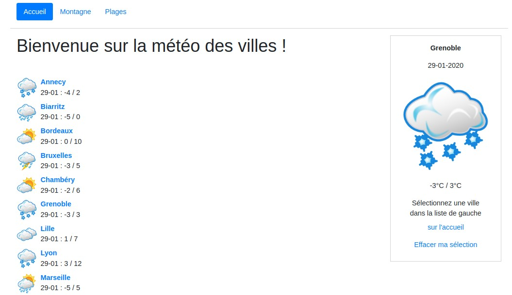

## Bonjour et bienvenu sur la météo des villes

Petit exercice en Symfony m'ayant permis d'exercer les préférences utilisateurs en favoris.

Pour l'installation:

- clone du projet: `git clone copie repo`
- installation projet `composer install`

et c'est tout!